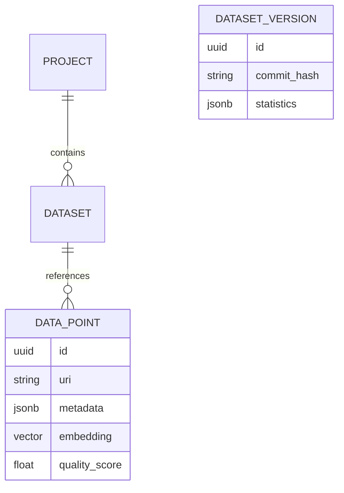

# Pinnacle Data Platform: Design & Architecture (2026 Edition)

## 1. Vision
The Pinnacle Data Platform is designed to be the "OS for Data-Centric AI." In the era of Generative AI (2025-2026), the bottleneck is no longer model architecture but **data quality, curation, and synthetic augmentation**.

Pinnacle moves beyond simple "data labeling" to become a comprehensive **Data Foundry**. It integrates **semantic search**, **automated quality observability**, and **generative synthesis** into a single, cohesive workflow.

## 2. Core Philosophy
*   **AI-Native Curation**: Data is not selected by random sampling but by semantic value (embeddings). We prioritize "high-entropy" samples that the model finds difficult.
*   **Hybrid Storage**: Structured metadata lives in SQL, unstructured data in Object Storage, and semantic meaning in Vector Indices.
*   **Synthetic First**: If real data is scarce, the platform natively supports generating synthetic variants using LLMs/Diffusion models to fill distribution gaps.
*   **Observability & Trust**: Every dataset version has an automated "Health Card" tracking drift, bias, and distribution stats.

## 3. Architecture Overview

### 3.1 Tech Stack
*   **Backend**: Python 3.10+ with **FastAPI**. Chosen for its speed (`uvloop`), async capabilities, and rich ecosystem for ML (Pydantic, NumPy integration).
*   **Frontend**: **Next.js 14+** (TypeScript). React Server Components for performance, Tailwind CSS for rapid UI development.
*   **Database**: **PostgreSQL 16** with `pgvector`.
    *   *Justification*: In 2025/2026, the trend is towards "converged" databases. Managing a separate vector DB (like Milvus/Weaviate) adds complexity. Postgres is "good enough" for <100M vectors and simplifies transactional + semantic queries (e.g., "Find images of 'cars' (vector) annotated by 'User A' (SQL) after '2025-01-01' (SQL)").
*   **Orchestration**: Docker Compose (Dev) / Kubernetes (Prod).

### 3.2 Key Components

1.  **Project Management**:
    *   Workspaces for different teams.
    *   RBAC (Role-Based Access Control).

2.  **Dataset Versioning (The "Git" for Data)**:
    *   Immutable dataset versions.
    *   Lineage tracking (Source -> Transformation -> Version).
    *   Concept: "Datasets" are logical views over "DataPoints".

3.  **Semantic Engine**:
    *   Auto-embedding generation (CLIP, SigLIP, or text-embedding-3) upon data upload.
    *   Clustering interface to find "Visual/Semantic Groups".
    *   Outlier detection to find anomalies.

4.  **Synthetic Foundry**:
    *   Interface to define "Generative Prompts".
    *   Pipeline to trigger external APIs (Gemini, OpenAI) or local models to generate data.
    *   Review loop for synthetic data.

## 4. Data Model (Simplified)

## 5. User Workflows

### A. The Curation Loop
1.  **Ingest**: User uploads 100k raw images/texts.
2.  **Index**: System computes embeddings in background.
3.  **Explore**: User visualizes data in a 2D UMAP scatter plot.
4.  **Curate**: User selects a "cluster" of interest (e.g., "dark images") or uses "semantic search" ("find me red trucks").
5.  **Tag/Label**: User tags this subset for labeling or synthesizes similar examples.

### B. The Synthetic Loop
1.  **Identify Gap**: "Health Card" shows low performance on "foggy weather".
2.  **Generate**: User prompts the Synthetic Foundry: "Generate 50 images of foggy highway driving".
3.  **Review**: Generated images appear in a "Review Queue".
4.  **Merge**: Approved images are added to a new Dataset Version.

## 6. Future Roadmap (2026+)
*   **Edge Sync**: Sync curated datasets directly to edge devices for federated learning.
*   **Agentic Curation**: Autonomous agents that continuously watch model performance and proactively curate new training data.
